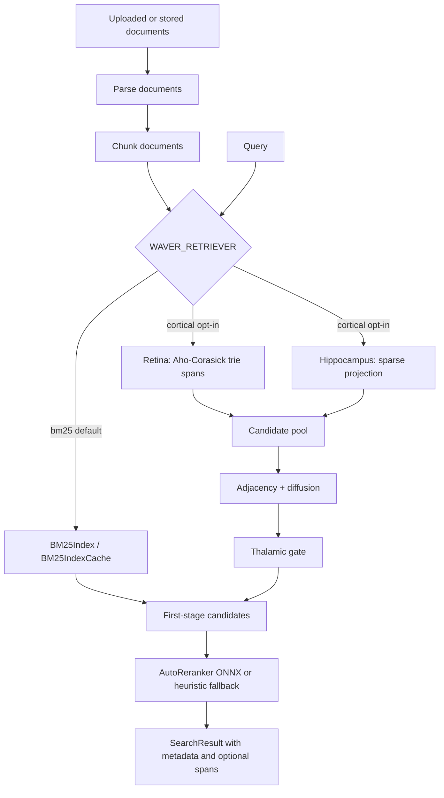

# Waver

Waver is a web app and API for instant search over messy data sources such as PDFs, CSVs,
JSON, logs, HTML, markdown, and pasted text. It parses uploaded content into documents,
runs just-in-time retrieval, and returns ranked passages with citation labels.

## Quick start

1. Copy `.env.example` to `.env`.
   API keys (`OPENROUTER_API_KEY` / `ANTHROPIC_API_KEY`) are optional for the current
   retrieval-first flow.
2. Run `make dev` for Docker-based development or `make install` followed by
   `make backend-dev` and `make frontend-dev` in separate terminals.
3. Open `http://localhost:3000` for the UI and `http://localhost:8000/docs` for the API docs.

## Current scope

This repository contains a runnable MVP for:

- Uploading files or pasted text
- Parsing common document formats
- Running ephemeral retrieval over stored parsed documents
- Returning ranked results with snippets, source metadata, and citation labels
- A Next.js frontend for upload, search, and demo flows (with backend-offline fallback)
- Connector scaffolding (Webhook/Slack) with live fetching disabled by default

## Current status

- Active search endpoints:
  - `POST /api/v1/search`
  - `POST /api/v1/search/stream`
- Current search response shape is retrieval-first:
  - `query`
  - `results`
  - `sources`
- LLM answer-generation code exists under `backend/app/answer`, but it is not currently wired into the active search response path.

## Retrieval architecture

Waver now has a swappable first-stage retriever. BM25 remains the default and the
long-term fallback. Cortical Trie Search is available behind `WAVER_RETRIEVER=cortical`
for structured or messy corpora where exact anchors, lightweight semantic recall, and
neighbor context can improve candidate quality before reranking.



The cortical path is query-time only. It does not require a persistent vector index or
database migrations:

- **Retina** builds query patterns and scans chunks with `pyahocorasick`, returning
  lexical scores and valid character spans.
- **Hippocampus** uses `HashingVectorizer` plus a projection matrix from
  `backend/models/projection.npz` when present.
- **NullProjection fallback** keeps cortical mode usable when the projection artifact is
  missing; semantic scores are zero and retrieval still uses trie, adjacency, diffusion,
  and gating.
- **Adjacency and diffusion** spread context across nearby chunks from the same source,
  page, row, section, or explicit adjacent chunk metadata.
- **AutoReranker** still performs the final ranking stage for both BM25 and cortical
  candidates.

Useful retrieval settings:

| Setting | Default | Purpose |
| --- | --- | --- |
| `WAVER_RETRIEVER` | `bm25` | Selects `bm25` or `cortical`. |
| `WAVER_CANDIDATE_CAP` | `2000` | Caps the cortical pre-gate candidate pool. |
| `WAVER_GATING_M` | `80` | Number of cortical candidates sent to reranking. |
| `PROJECTION_MODEL_PATH` | `models/projection.npz` | Optional sparse projection artifact. |
| `WAVER_TRIE_MAX_PATTERNS` | `2000` | Caps generated exact token/phrase patterns. |

To create a starter projection artifact locally:

```bash
cd backend
uv run python scripts/train_projection.py --out models/projection.npz
```

To verify retrieval behavior:

```bash
make test
```
